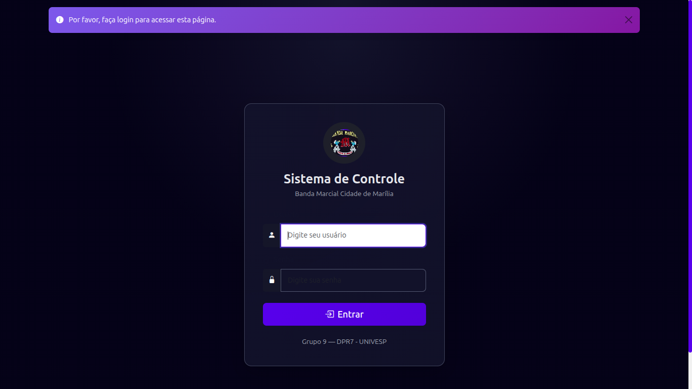
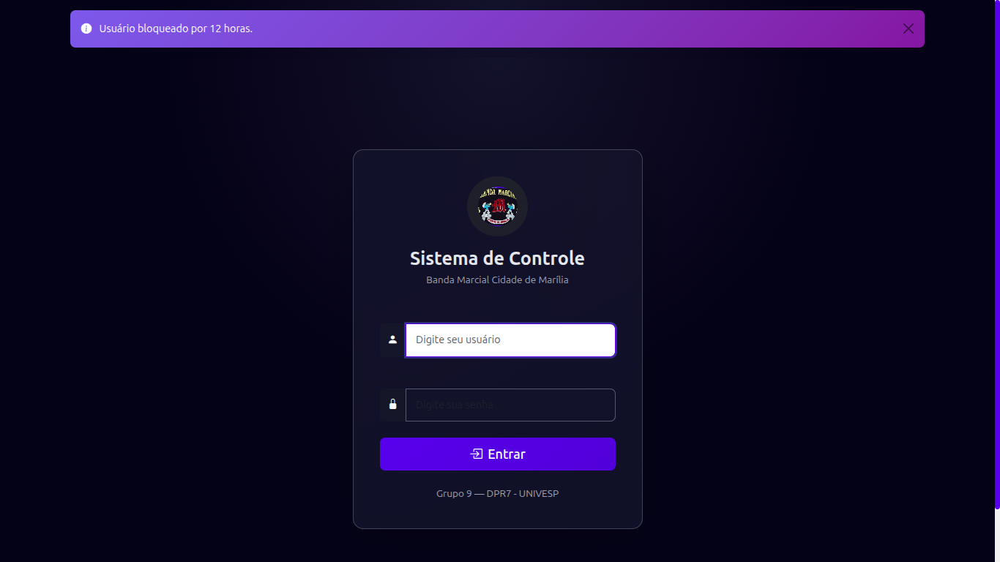

<div align="center">


</div>
### Sumário

1. [Nome do Projeto](#nome-do-projeto)
2. [Dependencias Principais](#dependencias-principais)
3. [Descritivo](#descritivo)
4. [Integrantes](#integrantes)
5. [Facilitadora UNIVESP](#facilitadora-univesp)
6. [Objetivos do Projeto](#objetivos-do-projeto)
7. [ Objetivos](#-objetivos)
8. [Códigos](#códigos)
9. [Funcionalidades](#funcionalidades)
10. [Print de Telas do Sistema](#print-de-telas-do-sistema)
11. [LICENÇA](#licença)
12. [Arquitetura / Estrutura do Projeto](#arquitetura--estrutura-do-projeto)
13. [Banco de Dados / Modelos](#banco-de-dados--modelos)
14. [Bibliografia](#bibliografia)

# Sistema de Gestão de Integrantes da Banda Marcial Municipal de Marília – SP

### Dependencias Principais


## Descritivo

- Aplicativo Web desenvolvido em Python em cumprimento ao Projeto Integrado I em  Computação do ano de 2026, pelos integrantes do Grupo 9 da DPR7, Para a Gestão dos integrantes da Banda Marcial Cidade de Marília.

## Integrantes

1. Adriano Guedes Ferraz
2. Alessandra da Silva Zanirato Garcia
3. Aparecido Fernandes de Souza
4. David  Miguel Soares Junior
5. Fabiane Fernanda de Barros Ranke
6. Felipe Oldani dos Santos
7. Kelly Cristina Ferreira da Costa
8. Rafael Veranelli Scalzo Moraes
9. Renato de Abreu Mantovanelli

## Facilitadora UNIVESP

- David Miguel Soares Junior

### Objetivos do Projeto

Projeto desenvolvido para facilitar o controle de integrantes da Banda Marcial Cidade de Marília, sendo eles alunos ou integrantes da Administração da banda.

Exemplo:

## 🎯 Objetivos

- Desenvolver habilidades práticas em Python e Flask
- Criar integração com banco de dados SQLite
- Aplicar conceitos de desenvolvimento web em um projeto real

## Códigos

```
Python

  from flask import Blueprint,   render_template, request, redirect, url_for, flash
  from flask_login import login_required, current_user
  from .models import User
  from . import db
  from .utils import admin_required, SENHA_PADRAO

main_bp = Blueprint("main", __name__)


@main_bp.route("/")
@login_required
def dashboard():
    return render_template("dashboard.html")


@main_bp.route("/admin")
@login_required
@admin_required
def painel_admin():
    return render_template("dashboard.html")


@main_bp.route("/admin/users")
@login_required
@admin_required
def listar_usuarios():
    usuarios = User.query.all()
    return render_template("admin_users.html", usuarios=usuarios)
    ...

```

### Funcionalidades

Lista clara do que o sistema consegue fazer.

Pode ser em bullets ou tabelas.

Exemplo:

####  Funcionalidades

- Cadastro de usuários, com funções de usuários e Administrador do sistema
- Cadastro de integrantes da banda, classificando entre integrantes da Banda e Adminstração, com as devidas funções
- Registro e consulta de dados
- Relatórios
- Interface responsiva usando Bootstrap

#### Print de Telas do Sistema






## LICENÇA

[](LICENSE)

### Arquitetura / Estrutura do Projeto

```
## projeto/
│
├── app/
│   ├── __pycache__
│   ├── __init__.py
│   ├── models.py
│   ├── auth.py
│   ├── admin.py
│   ├── routes.py
│   ├── utils.py
│   │
│   ├── Assets/
│   │   └── imgs/
|   │       ├── bloq.png
|   │       ├── Login.png
|   │       ├── logo-univesp.png
|   │       └── logo.jpeg
│   ├── templates/
│   ├── admin_user_form.html
│   ├── admin_users.html
│   ├── base.html
│   ├── change_password.html
│   ├── dashboard.html
│   ├── index.html
│   ├── login.html
│   ├── change_password.html
│   ├──   
│   ├── static/
│   │   └── css/style.css
|   │
│   ├── instance/
│   │   └── database.db
│   │ 
│   ├── config.py
|   ├── municipios.sql
|   ├── run.py
|   ├── requirements.txt
|   └── README.md


```

### Banco de Dados / Modelos

O banco de dados configurado no sistema é o SQLite3.
Nome da Base de Dados: database.db

as base de dados são criadas pelo arquivo models.py
 ```
 Python


from datetime import datetime
from flask_login import UserMixin
from werkzeug.security import generate_password_hash, check_password_hash
from . import db


# ========================
# MODELO DE USUÁRIO (Auth)
# ========================
class User(UserMixin, db.Model):
    id = db.Column(db.Integer, primary_key=True)
    username = db.Column(db.String(100), unique=True, nullable=False)
    password = db.Column(db.String(255), nullable=False)

    is_admin = db.Column(db.Boolean, default=False)
    is_active = db.Column(db.Boolean, default=True)
    must_change_password = db.Column(db.Boolean, default=True)

    login_attempts = db.Column(db.Integer, default=0)
    blocked_until = db.Column(db.DateTime, nullable=True)

    def set_password(self, password):
        self.password = generate_password_hash(password)

    def check_password(self, password):
        return check_password_hash(self.password, password)


# ========================
# MODELOS DE BANDA MARCIAL
# ========================

# Tabela de referência: Naipe (seções da banda)
class Naipe(db.Model):
    id = db.Column(db.Integer, primary_key=True)
    nome = db.Column(db.String(100), nullable=False)
    
    # Relacionamento com instrumentos
    instrumentos = db.relationship('Instrumento', backref='naipe', lazy=True)


# Tabela de referência: Funções na banda
class FuncaoBanda(db.Model):
    id = db.Column(db.Integer, primary_key=True)
    nome_funcao = db.Column(db.String(100), nullable=False)


# Tabela de referência: Tipos de instrumento
class TipoInstrumento(db.Model):
    id = db.Column(db.Integer, primary_key=True)
    nome = db.Column(db.String(50), nullable=False)
    
    # Relacionamento com instrumentos
    instrumentos = db.relationship('Instrumento', backref='tipo', lazy=True)


# Tabela: Escolas
class Escola(db.Model):
    id = db.Column(db.Integer, primary_key=True)
    nome = db.Column(db.String(200), nullable=False)
    endereco = db.Column(db.String(300))
    
    # Relacionamento com alunos
    alunos = db.relationship('AlunoEscola', backref='escola', lazy=True)


# Tabela: Alunos
class Aluno(db.Model):
    id = db.Column(db.Integer, primary_key=True)
    nome = db.Column(db.String(200), nullable=False)
    data_nascimento = db.Column(db.Date, nullable=True)
    naturalidade = db.Column(db.String(100))
    cin_rg = db.Column(db.String(20), unique=True)
    uid_vt = db.Column(db.String(20), unique=True, nullable=True)
    email = db.Column(db.String(150))
    telefone = db.Column(db.String(20))
    endereco = db.Column(db.String(300))
    cidade = db.Column(db.String(100))
    foto_path = db.Column(db.String(500))
    ativo = db.Column(db.Boolean, default=True)
    created_at = db.Column(db.DateTime, default=datetime.utcnow)
    
    # Relacionamentos
    responsaveis = db.relationship('Responsavel', backref='aluno', lazy=True, cascade='all, delete-orphan')
    uniforme = db.relationship('Uniforme', backref='aluno', lazy=True, cascade='all, delete-orphan')
    presencas = db.relationship('Presenca', backref='aluno', lazy=True, cascade='all, delete-orphan')
    instrumentos = db.relationship('AlunoInstrumento', backref='aluno', lazy=True, cascade='all, delete-orphan')
    escolas = db.relationship('AlunoEscola', backref='aluno', lazy=True, cascade='all, delete-orphan')


# Tabela: Responsáveis (pais/responsáveis)
class Responsavel(db.Model):
    id = db.Column(db.Integer, primary_key=True)
    aluno_id = db.Column(db.Integer, db.ForeignKey('aluno.id'), nullable=False)
    nome_pai = db.Column(db.String(200))
    nome_mae = db.Column(db.String(200))
    telefone = db.Column(db.String(20))
    email = db.Column(db.String(150))
    endereco = db.Column(db.String(300))


# Tabela: Relação Aluno-Escola
class AlunoEscola(db.Model):
    id = db.Column(db.Integer, primary_key=True)
    aluno_id = db.Column(db.Integer, db.ForeignKey('aluno.id'), nullable=False)
    escola_id = db.Column(db.Integer, db.ForeignKey('escola.id'), nullable=False)
    data_matricula = db.Column(db.Date, default=datetime.utcnow().date)


# Tabela: Instrumentos
class Instrumento(db.Model):
    id = db.Column(db.Integer, primary_key=True)
    nome = db.Column(db.String(100), nullable=False)
    tipo_id = db.Column(db.Integer, db.ForeignKey('tipo_instrumento.id'))
    naipe_id = db.Column(db.Integer, db.ForeignKey('naipe.id'))
    patrimonio = db.Column(db.String(50), unique=True)
    marca = db.Column(db.String(100))
    modelo = db.Column(db.String(100))
    estado = db.Column(db.String(50))  # Novo, Bom, Regular, Ruim
    data_aquisicao = db.Column(db.Date)
    observacoes = db.Column(db.Text)
    ativo = db.Column(db.Boolean, default=True)
    
    # Relacionamento com alunos
    alunos = db.relationship('AlunoInstrumento', backref='instrumento', lazy=True, cascade='all, delete-orphan')


# Tabela: Relação Aluno-Instrumento
class AlunoInstrumento(db.Model):
    id = db.Column(db.Integer, primary_key=True)
    aluno_id = db.Column(db.Integer, db.ForeignKey('aluno.id'), nullable=False)
    instrumento_id = db.Column(db.Integer, db.ForeignKey('instrumento.id'), nullable=False)
    data_emprestimo = db.Column(db.Date, default=datetime.utcnow().date)
    data_devolucao = db.Column(db.Date, nullable=True)
    observacoes = db.Column(db.Text)


# Tabela: Uniformes
class Uniforme(db.Model):
    id = db.Column(db.Integer, primary_key=True)
    aluno_id = db.Column(db.Integer, db.ForeignKey('aluno.id'), nullable=False)
    data_entrega = db.Column(db.Date)
    tamanho = db.Column(db.String(10))
    observacoes = db.Column(db.Text)


# Tabela: Presenças
class Presenca(db.Model):
    id = db.Column(db.Integer, primary_key=True)
    aluno_id = db.Column(db.Integer, db.ForeignKey('aluno.id'), nullable=False)
    data_presenca = db.Column(db.Date, default=datetime.utcnow().date)
    presente = db.Column(db.Boolean, default=True)
    observacoes = db.Column(db.Text)


 ```

### Bibliografia

 - Documentos institucionais UNIVESP (obrigatórios):
    - UNIVESP. Orientações para alunos de Projeto Integrador. São Paulo: UNIVESP, 2023.
    - Disponível em: https://assets.univesp.br/Proj_Integrador/2023-1S/=Orientacoes_para_alunos_de_PI.pdf. Acesso em: 11 mar. 2026.​
    - UNIVESP. Orientações para avaliação do Projeto Integrador. São Paulo: UNIVESP, 2021. 
    - Disponível em: https://assets.univesp.br/Proj_Integrador/Orient_para_avaliacao_do_PI_jan2021.pdf. Acesso em: 11 mar. 2026.​
    - Metodologia de pesquisa e ABPP:
    - AKATOS, E. M.; MARCONI, M. A. Fundamentos de metodologia científica. 8. ed. São Paulo: Atlas, 2020.
    - GIL, A. C. Como elaborar projetos de pesquisa. 6. ed. São Paulo: Atlas, 2019.
    - PLONSKY, I.; CAMPOS, A. M. Aprendizagem baseada em problemas: fundamentos e aplicações. São Paulo: Saraiva, 2021.
 - Bandas Marciais e Gestão de Integrantes
    - Artigos sobre bandas marciais:
         -SOARES, J. Ordem unida: aspectos básicos no desenvolvimento performático marcial. Anais do Congresso ANPPOM, 2024. Disponível em: https://anppom.org.br/anais/.... Acesso em: 11 mar. 2026.​
        - Educação musical e bandas escolares:
        - FUNARTE. Uma experiência em educação musical escolar. Anais do Seminário..., [s.l.], [s.d.]. Disponível em: https://seer.fundarte.rs.gov.br/.... Acesso em: 11 mar. 2026.​
 - Livros clássicos:
    - CASTRO, D. Bandas marciais escolares: organização e regência. Rio de Janeiro: FUNARTE, 2018.
    - SILVA, M. A. Gestão de grupos musicais comunitários. São Paulo: Annablume, 2020.
 - Sistemas de Informação para Controle de Pessoas
    - Análise e projeto de sistemas:
        - SOMMERVILLE, I. Engenharia de software. 10. ed. Porto Alegre: Bookman, 2019.
        - PRESSMAN, R. S. Engenharia de software: uma abordagem profissional. 9. ed. Porto Alegre: AMGH, 2020.
        - Digitalização de processos manuais:
            - LAUDON, K. C.; LAUDON, J. P. Sistemas de informação gerenciais. 14. ed. São Paulo: Pearson, 2021.
            - O’BRIEN, J. A.; MARACAS, R. F. Introdução a sistemas de informação. São Paulo: McGraw-Hill, 2019.
    - Estudo de caso brasileiro:
        - CASO Maringá: Gestão de processos administrativos. 35ª SEMAD-USP, [s.l.], [s.d.].
        - Disponível em: https://edisciplinas.usp.br/.... Acesso em: 11 mar. 2026.​
 - Desenvolvimento de Sistemas Web com Python/Flask + Bootstrap
        - Documentação oficial e livros fundamentais:
            - GRULZ, M. Flask web development: developing web applications with Python. 2. ed. O'Reilly, 2018.
    - Bootstrap oficial:
        - OTTONELLO, J. Bootstrap 5: o guia completo. 1. ed. Novatec, 2022.
        - BOOTSTRAP. Documentação oficial Bootstrap 5. 2023-2026. Disponível em: https://getbootstrap.com/docs/5.3/. Acesso em: 11 mar. 2026.
    - Tutoriais e práticas integrando Flask + Bootstrap:
        - REVELO. Telas de registro e login com Flask e Firebase. 2023. Disponível em: https://community.revelo.com.br/.... Acesso em: 11 mar. 2026.​
        - KINSTA. Aplicativo Python Flask: criação e implantação. 2024. Disponível em: https://kinsta.com/pt/blog/.... Acesso em: 11 mar. 2026.​
    - Artigos acadêmicos específicos:
        - SANTOS, J.; SILVA, R. Desenvolvimento responsivo de sistemas web com Flask e Bootstrap para gestão escolar. Revista Brasileira de Informática na Educação, v. 33, n. 2, p. 78-95, 2025.
        - FERREIRA, A. Integração Bootstrap em aplicações Flask: boas práticas para interfaces administrativas. Congressos Brasileiros de Software, p. 210-225, 2024.
