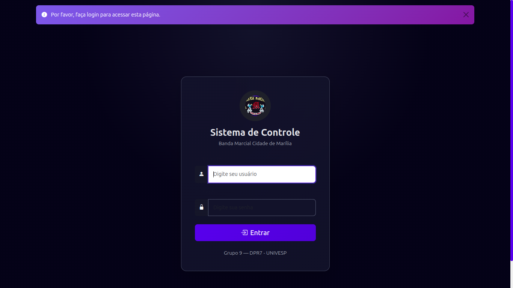
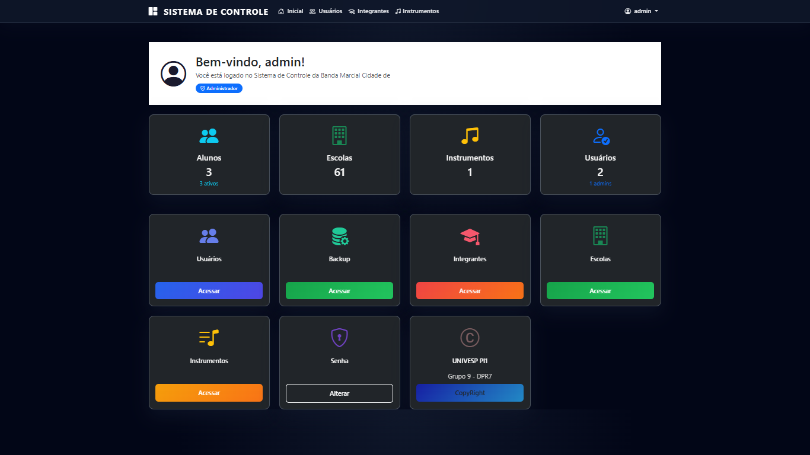

# Sistema de Cadastro de Integrantes da Banda Marcial Cidade de Marília

<div align="center">


</div>

<div align="center">

**Universidade Virtual do Estado de São Paulo (UNIVESP)**

Curso: Eixo de Computação

Disciplina: Projeto Integrado I

Turma: DPR7 — Grupo 9

Polos: Assis, Garça, Marília, Pompeia, Vera Cruz — SP

Tutor: David Miguel Soares Junior

2026

</div>

---

## Sumário

1. [Resumo](#resumo)
2. [Nome do Projeto](#nome-do-projeto)
3. [Contexto e Justificativa](#contexto-e-justificativa)
4. [Objetivos](#objetivos)
5. [Escopo Funcional](#escopo-funcional)
6. [Metodologia](#metodologia)
7. [Tecnologias Utilizadas](#tecnologias-utilizadas)
8. [Arquitetura e Estrutura do Projeto](#arquitetura-e-estrutura-do-projeto)
9. [Modelo de Dados](#modelo-de-dados)
10. [Regras de Negócio Relevantes](#regras-de-negócio-relevantes)
11. [Instalação e Configuração](#instalação-e-configuração)
12. [Execução do Sistema](#execução-do-sistema)
13. [Testes Automatizados](#testes-automatizados)
14. [Segurança e Boas Práticas](#segurança-e-boas-práticas)
15. [Evidências de Interface](#evidências-de-interface)
16. [Conclusão](#conclusão)
17. [Considerações Finais](#considerações-finais)
18. [Integrantes](#integrantes)
19. [Facilitador UNIVESP](#facilitador-univesp)
20. [Licença](#licença)
21. [Bibliografia](#bibliografia)

---

## Resumo

O presente projeto visa desenvolver um sistema digital para o cadastro e gerenciamento dos integrantes da Banda Marcial Cidade de Marília, diante da ausência de uma solução informatizada para esse processo. Atualmente, o controle é realizado por meio de fichas físicas, o que compromete a organização, a integridade e a recuperação eficiente dos dados. Nesse contexto, propõe-se a criação de um sistema computacional baseado em arquitetura web, com integração a banco de dados relacional, visando otimizar o armazenamento, a consulta e a atualização das informações dos integrantes. A metodologia adotada contempla o levantamento de requisitos funcionais e não funcionais, modelagem do sistema, desenvolvimento da aplicação e testes de validação, garantindo a aderência às necessidades dos usuários. Como resultados parciais, espera-se a implementação de um protótipo funcional com interface intuitiva, capaz de realizar operações de cadastro, edição, busca e organização dos dados por critérios específicos, como ordem alfabética e função na banda. Conclui-se que a adoção de uma solução digital tende a aumentar a eficiência da gestão, reduzir inconsistências e promover maior segurança e acessibilidade das informações, contribuindo para a modernização dos processos administrativos da instituição.

**Palavras-chave:** Sistema digital; Cadastro de usuários; Gestão de dados; Banda marcial; Tecnologia da informação.

---

## Nome do Projeto

Sistema de Cadastro de Integrantes da Banda Marcial Cidade de Marília — SP, desenvolvido no contexto do Projeto Integrado I (UNIVESP).

---

## Contexto e Justificativa

A transformação digital tem impactado significativamente a forma como organizações gerenciam suas informações, promovendo maior eficiência, agilidade e confiabilidade nos processos administrativos. Nesse contexto, os sistemas de informação assumem papel estratégico, sendo responsáveis por coletar, processar, armazenar e disponibilizar dados de forma estruturada, apoiando a tomada de decisão e o controle organizacional (Laudon; Laudon, 2021).

A substituição de processos manuais por soluções digitais tem se mostrado essencial para reduzir erros operacionais, aumentar a produtividade e garantir maior segurança das informações. Sistemas baseados em registros físicos apresentam limitações, como dificuldade de acesso, maior risco de perda de dados e baixa eficiência na organização das informações, o que compromete a gestão e a confiabilidade dos registros (Stair; Reynolds, 2020).

A Banda Marcial Cidade de Marília desempenha um importante papel social, cultural e educacional na comunidade, promovendo a integração de jovens por meio da música e de atividades coletivas. No entanto, observa-se a ausência de um sistema digital para o cadastro e gerenciamento de seus integrantes. Atualmente, o controle das informações é realizado por meio de fichas físicas, o que dificulta a organização, atualização e recuperação dos dados. Essa limitação impacta diretamente na eficiência da gestão, especialmente no que se refere à classificação por ordem alfabética e à organização por função desempenhada na banda.

Além disso, o uso de registros manuais aumenta a probabilidade de erros, perda de informações e inconsistências nos dados, comprometendo a confiabilidade do controle administrativo. Tal cenário evidencia a necessidade de modernização do processo de gestão, por meio da implementação de uma solução digital que proporcione maior agilidade, segurança e organização das informações.

---

## Objetivos

### Objetivo Geral

Desenvolver um sistema digital para automatizar o cadastro dos integrantes da Banda Marcial Cidade de Marília/SP, permitindo o registro, a edição e a consulta das informações de forma organizada. O sistema deverá facilitar a atualização de dados, como endereço e função dos integrantes, além de contribuir para uma gestão mais eficiente das informações da banda.

O sistema possui flexibilidade para adequar-se a outras instituições, sejam elas filantrópicas ou particulares, possibilitando sua utilização em diferentes contextos organizacionais e administrativos.

### Objetivos Específicos

- Levantar e analisar as necessidades da Banda Marcial Cidade de Marília em relação ao processo de cadastro e gestão dos integrantes.
- Definir a estrutura de dados necessária para o armazenamento das informações dos integrantes da banda, como nome, endereço e função desempenhada.
- Desenvolver um sistema de cadastro digital que permita o registro, edição e consulta das informações dos participantes.
- Implementar uma interface simples e intuitiva para facilitar o uso do sistema pelos responsáveis pela gestão da banda.
- Testar o sistema desenvolvido e verificar sua adequação às necessidades da instituição.

---

## Escopo Funcional

Funcionalidades implementadas no estado atual do projeto:

- **Autenticação e contas**
  - Login com bloqueio após 3 tentativas inválidas consecutivas (12 horas).
  - Troca obrigatória de senha no primeiro acesso.
  - Gestão de usuários — criar, editar, ativar/inativar, reset de senha, excluir.
  - Proteção do usuário admin padrão contra exclusão ou alteração por terceiros.

- **Gestão de integrantes**
  - Cadastro, edição, inativação (soft delete) e listagem com filtros.
  - Dados pessoais, contato, endereço completo (com busca por CEP), responsáveis e vinculação escolar.
  - Upload de foto do integrante com validação de formato.
  - Consentimento de imagem para menores de 18 anos (LGPD), com assinatura digital do responsável.
  - Normalização automática de dados textuais (caixa alta) e telefones.

- **Gestão de escolas**
  - Cadastro, edição, exclusão e relatório por escola com total de matrículas.

- **Gestão de instrumentos**
  - Cadastro, edição, ativação/inativação e exclusão.
  - Campos de estado (Novo, Bom, Regular, Ruim), patrimônio único, marca, modelo, data de aquisição e observações.
  - Classificação por tipo (Sopro, Percussão) e naipe (Madeira, Metais, Percussão, Clarim).

- **Relatórios**
  - Relatório geral de integrantes ativos.
  - Relatório individual de integrante.
  - Relatório de escolas com quantidade de matrículas.
  - Layout profissional para impressão.

- **Endereço por CEP**
  - Busca local em base de logradouros importada.
  - Fallback para API ViaCEP quando não encontrado localmente.
  - Salvamento automático de novos logradouros na base local.

---

## Metodologia

Este projeto caracteriza-se como uma pesquisa aplicada, de natureza qualitativa e com abordagem exploratória e descritiva. A pesquisa aplicada tem como objetivo gerar conhecimentos para a solução de problemas específicos, neste caso, a ausência de um sistema digital para o cadastro e gerenciamento dos integrantes da Banda Marcial Cidade de Marília (Gil, 2019).

A abordagem qualitativa foi adotada por permitir a compreensão do contexto organizacional e das necessidades dos usuários, sem a utilização de dados estatísticos, focando na interpretação das informações coletadas. Já o caráter exploratório justifica-se pela necessidade de aprofundar o conhecimento sobre o problema e identificar possíveis soluções, enquanto o aspecto descritivo busca detalhar as características do sistema a ser desenvolvido e seu funcionamento (Prodanov; Freitas, 2013).

O desenvolvimento do projeto foi estruturado em etapas:

1. **Levantamento de requisitos**: identificação das necessidades dos usuários e das funcionalidades essenciais do sistema (cadastro, edição, exclusão, consulta).
2. **Modelagem do sistema**: definição da estrutura do banco de dados e das funcionalidades da aplicação, com base em um modelo relacional.
3. **Desenvolvimento**: implementação das funcionalidades utilizando tecnologias web com integração a banco de dados relacional.
4. **Testes de funcionalidade**: verificação do correto funcionamento, identificação de falhas e garantia de adequação às necessidades levantadas.

A aplicação foi estruturada com base na arquitetura cliente-servidor, sendo o backend desenvolvido na linguagem Python com o framework Flask. Para a persistência de dados, foi adotado o banco de dados SQLite3, conforme sugestão institucional, com manipulação via ORM SQLAlchemy. O frontend foi desenvolvido com HTML, CSS e JavaScript, com o apoio do framework Bootstrap, visando garantir responsividade e padronização visual em diferentes dispositivos (Marcato, 2023; Otto; Thornton, 2024).

---

## Tecnologias Utilizadas


Principais bibliotecas (conforme `requirements.txt`):
- Flask, Flask-Login, Flask-SQLAlchemy
- SQLAlchemy
- Requests (integração CEP)
- Gunicorn (deploy)
- BeautifulSoup4
- Waitress (Produção)

---

## Arquitetura e Estrutura do Projeto

O projeto segue arquitetura cliente-servidor em camadas leves, com padrão MVC (Model-View-Controller), utilizando Flask:

- `app/__init__.py`: factory da aplicação, inicialização do banco, login manager e seed inicial.
- `app/auth.py`: rotas de autenticação.
- `app/routes.py`: rotas de domínio (usuários, alunos, escolas, instrumentos, relatórios).
- `app/models.py`: modelos SQLAlchemy.
- `app/utils.py`: regras auxiliares, normalização, seed e funções de consentimento.
- `templates/`: telas HTML (Bootstrap + Jinja2).
- `static/`: arquivos estáticos (CSS, imagens e uploads).
- `tests/`: testes automatizados com pytest.
- `run.py`: ponto de entrada para execução local.
- `config.py`: configurações da aplicação.

Estrutura resumida:

```text
.
├── app/
│   ├── __init__.py
│   ├── auth.py
│   ├── models.py
│   ├── routes.py
│   └── utils.py
├── templates/
├── static/
├── tests/
│   └── test_aluno_fluxo.py
├── assets/
│   └── imgs/
├── config.py
├── run.py
└── requirements.txt
```

---

## Modelo de Dados

Banco principal: SQLite (`instance/database.db` por padrão).

Entidades mapeadas:

- `User` — usuários do sistema (autenticação e perfis)
- `Aluno` — integrantes da banda
- `Responsavel` — responsáveis legais dos integrantes
- `Escola` — escolas parceiras
- `AlunoEscola` — vínculo entre integrante e escola
- `Instrumento` — instrumentos musicais
- `AlunoInstrumento` — empréstimo de instrumentos
- `Uniforme` — controle de uniformes
- `Presenca` — registro de presenças
- `Cidade` — municípios brasileiros
- `Logradouro` — endereços por CEP
- `AutorizacaoFotoMenor` — consentimento LGPD para imagem de menor
- `AutorizacaoViagem` — autorização para viagens/eventos
- `Evento` — eventos e apresentações
- Tabelas de referência: `Naipe`, `TipoInstrumento`, `FuncaoBanda`

Observações:
- `Aluno.cin_rg` é único.
- O sistema cria automaticamente dados iniciais de tipos/naipes/funções.
- Há importação automática de municípios/logradouros quando o arquivo `municipios.sql` está presente.

---

## Regras de Negócio Relevantes

- **Acesso**: Rotas administrativas exigem usuário autenticado e, quando aplicável, perfil admin.
- **Bloqueio de login**: Após 3 tentativas inválidas, o usuário é bloqueado por 12 horas.
- **Dados de integrantes**: Integrantes podem ser inativados para preservar histórico. Campos textuais são normalizados em caixa alta.
- **Documento no cadastro**: Campo `cin_rg` aceita formato de CIN/RG e CPF no frontend, com máscara dinâmica.
- **Consentimento de imagem de menor (LGPD)**: Para menor de 18 anos (ou data ausente), há exigência de autorização quando houver foto. O consentimento inclui aceite e assinatura digital desenhada no navegador, com armazenamento do termo versionado e dados de auditoria (IP, usuário, data/hora).

---

## Instalação e Configuração

### Pré-requisitos

- Python 3.12+
- `venv` habilitado no sistema

### Passos

```bash
cd "C:\SistemaBMCM\
pip install --upgrade pip
pip install -r requirements.txt
```

### Variáveis de ambiente (opcionais)

- `SECRET_KEY`: chave de sessão Flask.
- `DATABASE_URL`: URL do banco; se ausente, usa SQLite local em `instance/database.db`.

Exemplo:

```bash
export SECRET_KEY="sua_chave_forte"
export DATABASE_URL="sqlite:///instance/database.db"
```

---

## Execução do Sistema

Com ambiente virtual ativo:

```bash
python run.py
```

Por padrão, o sistema cria tabelas e dados iniciais automaticamente no startup.

### Credencial inicial

Quando não existe usuário administrador no banco, o sistema cria:
- usuário: `admin`
- senha inicial: `123456`

No primeiro login, a troca de senha é obrigatória.

---

## Testes Automatizados

Suite atual implementada:

- `tests/test_aluno_fluxo.py`
  - Criação de integrante;
  - Edição de integrante;
  - Persistência de documento no `cin_rg` com valor em formato de CPF.

Execução:

```bash
./venv/bin/python -m pytest -q tests/test_aluno_fluxo.py
```

Ou para todos os testes:

```bash
./venv/bin/python -m pytest -q
```

---

## Segurança e Boas Práticas

- Senhas armazenadas com hash + salt (Werkzeug).
- Controle de sessão com Flask-Login.
- Bloqueio temporário por tentativas inválidas de login.
- Consentimento explícito para uso de imagem de menor, com auditoria LGPD.
- Recomendado para produção:
  - Definir `SECRET_KEY` forte via ambiente;
  - Rodar atrás de servidor WSGI (ex.: Gunicorn) e proxy reverso;
  - Ativar HTTPS.

---

## Evidências de Interface

Imagens presentes no repositório:

- 
- 
- 

---

## Conclusão

Até o presente momento, foi possível implementar uma versão inicial funcional do sistema proposto, contemplando as principais estruturas necessárias para sua operação. Dentre as funcionalidades desenvolvidas, destaca-se o sistema de autenticação de usuários, com armazenamento seguro de senhas por meio de técnicas de hash com adição de salt, e o controle de acesso baseado em autenticação. Foi implementado ainda um mecanismo de bloqueio temporário após três tentativas consecutivas de login inválidas.

O sistema já contempla operações completas de cadastro, edição e inativação de integrantes, bem como a gestão de instrumentos, escolas e usuários, caracterizando a implementação das principais funcionalidades previstas no escopo do projeto. A interface do usuário foi desenvolvida com Bootstrap, assegurando responsividade em diferentes dispositivos. Testes funcionais das principais operações demonstraram comportamento consistente.

Apesar dos avanços obtidos, ainda existem etapas a serem concluídas, como a implementação dos módulos de presença, uniforme, autorização de viagem e eventos, previstos para continuidade no Projeto Integrado II. No entanto, os resultados alcançados indicam que a solução proposta é viável e atende aos objetivos iniciais do projeto.

---

## Considerações Finais

O desenvolvimento do presente projeto proporcionou à equipe a oportunidade de aplicar, na prática, conceitos de engenharia de software, modelagem de banco de dados, desenvolvimento web e segurança da informação. A experiência de trabalhar com uma demanda real da comunidade — a Banda Marcial Cidade de Marília — reforçou a importância da tecnologia como ferramenta de transformação social e administrativa.

A adoção de uma solução digital tende a aumentar a eficiência da gestão, reduzir inconsistências e promover maior segurança e acessibilidade das informações, contribuindo para a modernização dos processos administrativos da instituição. O sistema desenvolvido é flexível o suficiente para ser adaptado a outras organizações similares, ampliando seu impacto social.

---

## Integrantes

1. Adriano Guedes Ferraz
2. Aparecido Fernandes de Souza
3. Fabiane Fernanda de Barros Ranke
4. Felipe Oldani dos Santos
5. Kelly Cristina Ferreira da Costa
6. Rafael Varanelli Scalzo Moraes
7. Renato de Abreu Mantovanelli

---

## Facilitador UNIVESP

- David Miguel Soares Junior (Tutor)

---

## Licença

[](LICENSE)

---

## Bibliografia

### Documentos institucionais UNIVESP

- UNIVESP. Orientações para alunos de Projeto Integrador. São Paulo: UNIVESP, 2023.
- UNIVESP. Orientações para avaliação do Projeto Integrador. São Paulo: UNIVESP, 2021.

### Metodologia e desenvolvimento de software

- GIL, A. C. Métodos e técnicas de pesquisa social. 7. ed. São Paulo: Atlas, 2019.
- GRINBERG, M. Flask Web Development: Developing Web Applications with Python. 2. ed. Sebastopol: O'Reilly Media, 2018.
- PRESSMAN, R. S.; MAXIM, B. R. Engenharia de software: uma abordagem profissional. 9. ed. Porto Alegre: AMGH, 2020.
- PRODANOV, C. C.; FREITAS, E. C. de. Metodologia do trabalho científico: métodos e técnicas da pesquisa e do trabalho acadêmico. 2. ed. Novo Hamburgo: Feevale, 2013.
- SOMMERVILLE, I. Engenharia de Software. 9. ed. São Paulo: Pearson Prentice Hall, 2011.
- SOMMERVILLE, I. Engenharia de Software. 10. ed. São Paulo: Pearson Education do Brasil, 2019.

### Banco de dados e sistemas de informação

- BAYER, M. SQLAlchemy: The Python SQL Toolkit and Object Relational Mapper. Version 2.0. 2023.
- ELMASRI, R.; NAVATHE, S. B. Fundamentals of database systems. 7. ed. Boston: Pearson, 2016.
- ELMASRI, R.; NAVATHE, S. B. Sistemas de Banco de Dados. 7. ed. Rio de Janeiro: LTC, 2018.
- LAUDON, K. C.; LAUDON, J. P. Management information systems: managing the digital firm. 16. ed. Harlow: Pearson, 2021.
- SILBERSCHATZ, A.; KORTH, H. F.; SUDARSHAN, S. Sistema de Banco de Dados. 7. ed. São Paulo: AMGH, 2019.
- STAIR, R. M.; REYNOLDS, G. W. Principles of information systems. 13. ed. Boston: Cengage Learning, 2020.
- TURBAN, E. et al. Information technology for management: driving digital transformation. 11. ed. Hoboken: Wiley, 2021.

### Segurança da informação

- STALLINGS, W. Criptografia e Segurança de Redes: Princípios e Práticas. 8. ed. Rio de Janeiro: Pearson, 2022.

### Frontend e frameworks

- MARCATO, P. S. HTML, CSS e JavaScript: Programação Front-end com foco na Prática. São Paulo: Érica, 2023.
- OTTO, M.; THORNTON, J. Bootstrap 5.3 Documentation. 2024.

### Outras referências

- BALEY, I.; VELDKAMP, L. The data economy: tools and applications. Princeton: Princeton University Press, 2025.
- LANGER, A. M. Information technology and organizational learning: managing behavioral change in the digital age. 4. ed. Boca Raton: CRC Press, 2024.
- MARTIN-NAVARRO, A. et al. BPMS for management: a systematic literature review. 2023.
- VOM BROCKE, J. Business process management and digital transformation. 2025.

### Diretrizes acadêmicas

- UNIVERSIDADE DE SÃO PAULO. Diretrizes para confecção de teses e dissertações da Universidade de São Paulo. Disponível em: <http://www.teses.usp.br/index.php?option=com_content&view=article&id=52&Itemid=67>. Acesso em: 24 jun. 2021.
